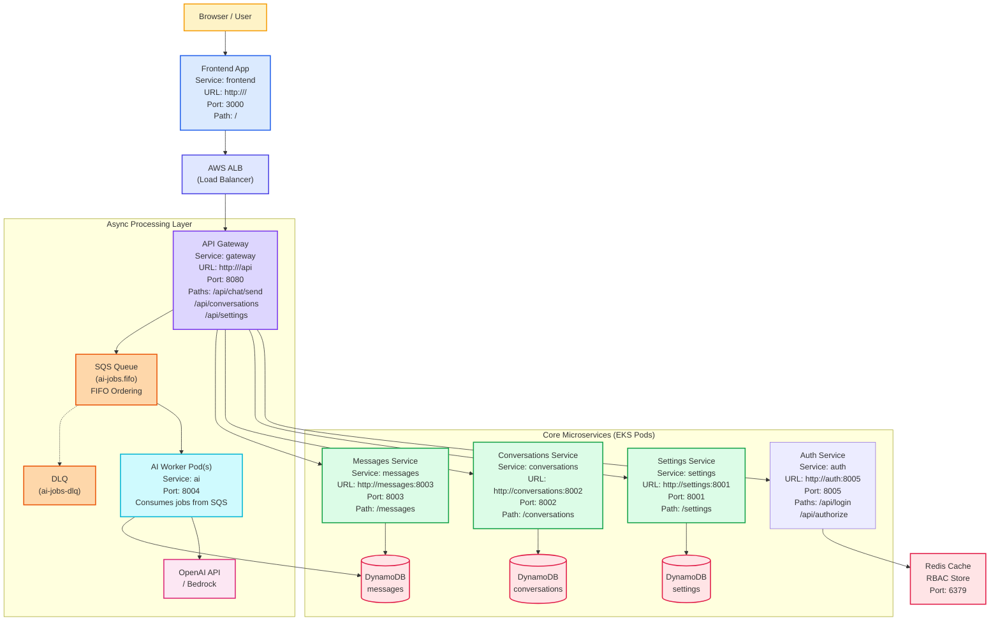
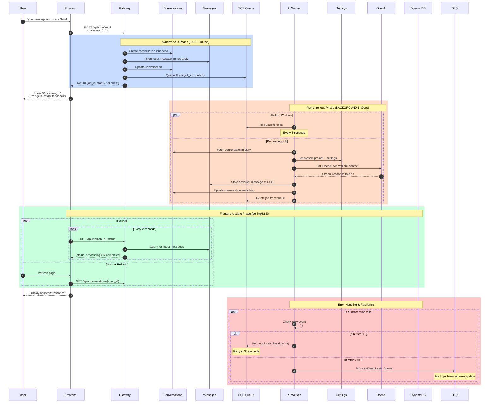

# LLM Chatbot - Microservices Architecture & Production Implementation

**This repository demonstrates both the learning-focused microservices architecture and the budget-optimized production implementation on AWS.**

---

## 📋 Table of Contents

1. [What This App Demonstrates](#what-this-app-demonstrates)
2. [System Overview](#system-overview)
3. [Architecture Comparison](#architecture-comparison)
4. [Production Architecture Diagram](#production-architecture-diagram)
5. [Request Flow - Async Production](#request-flow---async-production)
6. [Request Flow - Original Learning](#request-flow---original-learning)
7. [Repository Layout](#repository-layout)
8. [Port Map](#port-map)
9. [Prerequisites](#prerequisites)
10. [Quick Start](#quick-start)
11. [Frontend Setup and Run](#frontend-setup-and-run)
12. [Backend Setup and Run](#backend-setup-and-run)
13. [Deployment](#deployment)
14. [API Endpoints](#api-endpoints)
15. [Environment Variables](#environment-variables)
16. [Database Schema](#database-schema)
17. [Error Handling](#error-handling)
18. [Monitoring & Observability](#monitoring--observability)
19. [Cost Optimization](#cost-optimization-strategies)
20. [Best Practices for Microservices](#best-practices-for-microservices)
21. [Advantages and Disadvantages](#advantages-and-disadvantages-of-microservices)
22. [When to Choose Microservices](#when-to-choose-microservices)
23. [Migration Status](#migration-from-monolithic)
24. [YouTube Walkthrough Script](#youtube-walkthrough-script)
25. [Suggested Demo Commands](#suggested-demo-commands)
26. [Smoke Test](#smoke-test)
27. [Troubleshooting](#troubleshooting)
28. [Production Checklist](#production-checklist)
29. [Service-Level Guides](#service-level-guides)

---

## What This App Demonstrates

This repository is the microservices version of the chat demo. It shows how a real system grows beyond a monolith while keeping each service small, understandable, and independently replaceable.

**Concepts Covered:**

- ✅ Frontend served separately from the backend API
- ✅ Gateway that centralizes routing and request orchestration
- ✅ Independent services for settings, conversations, messages, and AI generation
- ✅ **Synchronous flow** (original learning architecture)
- ✅ **Asynchronous processing** (production budget-conscious architecture)
- ✅ Local persistence with Docker volumes (development)
- ✅ DynamoDB managed data persistence (production)
- ✅ SQS queue-based job processing (production)
- ✅ Auto-scaling strategies for microservices
- ✅ End-to-end smoke tests for verification

---

## Service-Level Guides

Each service now has its own developer checklist in the service folder. These are short, practical READMEs that explain what the service does, why it exists, and the one-line commands to run it, test it, lint it, and build its image.

- [Gateway](gateway/README.md) - the traffic router and API entry point
- [Conversations Service](conversations-service/README.md) - conversation history and metadata
- [Messages Service](messages-service/README.md) - stores user and assistant messages
- [Settings Service](settings-service/README.md) - system prompt and user preferences
- [AI Service](ai-service/README.md) - model / worker logic for answer generation
- [Frontend](frontend/README.md) - browser UI and smoke tests

Layman version: instead of reading one giant document, each folder now explains itself so a developer can open the right service, understand it quickly, and copy the commands they need.

---

## System Overview

The microservices architecture is intentionally feature-oriented:

| Component | Purpose |
|-----------|---------|
| **Frontend** (`frontend/`) | Provides the browser UI |
| **Gateway** (`gateway/`) | Single API entry point |
| **Settings Service** (`settings-service/`) | Manages system prompts and user preferences |
| **Conversations Service** (`conversations-service/`) | Handles conversation metadata and state |
| **Messages Service** (`messages-service/`) | Persists message records |
| **AI Service** (`ai-service/`) | Wraps model calls (original), or polls queue (production) |

**Why This Approach Matters:**

1. **Service Boundaries** - Clear separation of concerns
2. **Data Ownership** - Each service owns its database
3. **Scalability** - Services can scale independently
4. **Resilience** - Failures are isolated
5. **Independent Deployment** - Changes don't affect other services
6. **Technology Flexibility** - Each service can use different tech stack

---

## Architecture Comparison

### Learning Architecture vs Production Architecture

```
┌─────────────────────────────────────────────────────────────────────────────┐
│                                  LEARNING PHASE                              │
├─────────────────────────────────────────────────────────────────────────────┤
│ • Synchronous request/response flow                                         │
│ • SQLite databases (local volumes)                                          │
│ • AI service responds immediately                                           │
│ • Single-node deployment (Docker Compose)                                   │
│ • Perfect for understanding microservices concepts                          │
│ • Not suitable for production traffic                                       │
│ • Cost: ~$0/month (local only)                                             │
└─────────────────────────────────────────────────────────────────────────────┘

                            ↓ EVOLVE TO ↓

┌─────────────────────────────────────────────────────────────────────────────┐
│                             PRODUCTION PHASE                                 │
├─────────────────────────────────────────────────────────────────────────────┤
│ • Asynchronous SQS-based processing                                         │
│ • DynamoDB managed database (pay-per-request)                              │
│ • Background AI workers process jobs independently                          │
│ • Multi-AZ Kubernetes (EKS) deployment                                     │
│ • Handles millions of requests per month                                    │
│ • Built-in resilience and auto-scaling                                     │
│ • Cost: ~$264-464/month AWS infrastructure                                │
└─────────────────────────────────────────────────────────────────────────────┘
```

---

## Production Architecture Diagram



**Key Features of Production Architecture:**

✅ **Auto-Scaling**: Services scale from 0-10 pods based on demand  
✅ **Async Processing**: SQS queue handles traffic spikes gracefully  
✅ **DynamoDB**: Managed database with pay-per-request billing  
✅ **High Availability**: Multi-AZ EKS cluster with health checks  
✅ **Cost Optimized**: ~$264-464/month infrastructure cost  
✅ **Resilient**: Failed jobs captured in DLQ, can be retried  
✅ **Observable**: CloudWatch logs, X-Ray tracing, custom metrics  

---

## Request Flow - Async Production

When a user sends a message in **production** (with SQS async processing):

> **💡 Tip**: To view this diagram on [mermaid.live](https://mermaid.live), copy only the code **between** the backticks (don't include ` ```mermaid ` or ` ``` ` in your copy).



**Performance Timeline:**

| Step | Duration | Action |
|------|----------|--------|
| 1-5 | 0-100ms | Validate request, create conversation, queue job, return job_id |
| 6 | 100ms+ | User gets instant feedback "Processing..." |
| 7-9 | 1-30 sec | AI Worker fetches context and calls OpenAI (happens in background) |
| 10-11 | 30-35 sec | Response stored in DynamoDB |
| 12-14 | 35-40 sec | Frontend polls and displays response |
| **Total** | ~40 sec | Non-blocking, user saw instant response at 100ms! |

**Benefits Over Synchronous:**
- ✅ User gets immediate feedback (100ms vs 3-7 seconds)
- ✅ Can handle massive traffic spikes (queue acts as buffer)
- ✅ AI Worker failures don't impact user experience
- ✅ Failed jobs can be retried automatically
- ✅ Workers can scale up/down independently

---

## Request Flow - Original Learning

When a user sends a message in the **learning/original architecture** (synchronous, blocking):

> **💡 Tip**: To view this diagram on [mermaid.live](https://mermaid.live), copy only the code **between** the backticks (don't include ` ```mermaid ` or ` ``` ` in your copy).

```mermaid
sequenceDiagram
	autonumber
	participant U as User
	participant FE as Frontend
	participant GW as Gateway
	participant CON as Conversations
	participant MSG as Messages
	participant SET as Settings
	participant AI as AI Service

	U->>FE: Type message and press Send
	FE->>GW: POST /api/chat/send<br/>{message: "..."}<br/>BLOCKING REQUEST
	
	Note over GW,AI: Waiting for AI response...
	GW->>CON: Create conversation if needed
	GW->>MSG: Store user message
	GW->>CON: Append message to history
	GW->>SET: Read system prompt
	GW->>CON: Fetch recent conversation history

---

## CI / CD & Tests (What changed)

We added an automated CI/CD pipeline using GitHub Actions at `.github/workflows/ci.yml`.

What it does (simple):

- **Runs tests**: It uses `microservices/scripts/full_test_pass.py` so CI runs the same Python backend pass we validated locally, then runs frontend tests in `microservices/frontend`.
- **Builds Docker images**: Builds each microservice into a Docker image.
- **Pushes images to ECR**: Uploads built images to your AWS ECR registry.
- **Deploys with Helm**: Runs `helm upgrade --install` against the `infra/helm/chatapp` chart.

When it runs:

- `push` to `main` or `release/**`
- `pull_request` targeting `main` or `release/**`
- manual runs through `workflow_dispatch`
- only when files under `microservices/**`, `infra/**`, or `.github/workflows/**` change

Why this matters (layman):

- Saves time — changes are automatically tested and deployed.
- Reduces mistakes — tests run before deployment.
- Makes rollbacks and deployments repeatable.

In plain English: the pipeline checks the code first, packages each service into an image, uploads the image to AWS, and then tells Kubernetes to use the new version.

How to run tests locally:

```bash
# From repo root — run all Python service tests, including auth-service
python microservices/scripts/full_test_pass.py

# Run frontend tests
cd microservices/frontend
npm ci
npm run test:reports
```

The full test pass now includes the auth-service health test and auth flow test, in addition to the existing backend service tests.

How to run build+deploy locally (manual equivalent of CI):

```bash
# Build an example service image
docker build -t myaccount/llm-chatbot/gateway:local -f microservices/gateway/Dockerfile microservices/gateway

# Push to registry (example for ECR; set $ECR_REGISTRY first)
docker tag myaccount/llm-chatbot/gateway:local $ECR_REGISTRY/llm-chatbot/gateway:local
docker push $ECR_REGISTRY/llm-chatbot/gateway:local

# Deploy helm chart overriding the image
helm upgrade --install chatapp infra/helm/chatapp -n chatbot --create-namespace \
	--set images.gateway.repository=$ECR_REGISTRY/llm-chatbot/gateway --set images.gateway.tag=local
```

If you'd like, I can add per-service `README.md` files with a quick developer checklist (run tests, lint, build image), or add CI caching and test report uploads to the workflow. Which would you prefer next?
	
	GW->>AI: POST /generate<br/>{prompt, history, message}<br/>WAIT HERE...
	
	Note over AI: OpenAI API Call<br/>(2-5 seconds!)
	AI-->>GW: Assistant response
	
	GW->>MSG: Store assistant message
	GW->>CON: Append response to history
	GW-->>FE: Return updated conversation<br/>Finally!
	
	FE-->>U: Render assistant reply
	Note over U: Total wait: 3-7 seconds😞
```

**Original Architecture Characteristics:**

- ❌ User waits 3-7 seconds for response (blocking)
- ❌ If OpenAI API slow → user waits longer
- ❌ If OpenAI times out → request fails
- ❌ Single AI service = bottleneck
- ❌ Cannot handle traffic spikes
- ✅ Easier to understand (synchronous flow)
- ✅ Perfect for learning and demos
- ✅ Simpler error handling

**Perfect For:**
- Learning microservices concepts
- Small-scale demos
- Understanding request orchestration
- Teaching service boundaries

---

## How It Works - Deep Dive

### Async Production Flow Explained

#### **Phase 1: Synchronous Request Reception (0-100ms)**

When the user sends a message:

1. **Gateway validates** the request and creates a unique `job_id`
2. **Conversation is created** (if needed) and message is stored immediately
3. **SQS job is queued** with `{job_id, conversation_id, user_message, context}`
4. **User immediately gets feedback**: `{job_id, status: "queued"}` (100ms response time)

**Why this is fast**: The gateway doesn't wait for AI processing—it just enqueues a job and responds.

#### **Phase 2: Asynchronous Worker Processing (1-30 seconds)**

While the user sees "Processing...", in the background:

1. **AI Workers poll SQS** every 5 seconds for available jobs
2. **One worker claims the job** and processes it:
   - Fetches full conversation history
   - Retrieves system prompt from Settings service
   - Calls OpenAI API (2-5 seconds of total processing time)
   - Stores the assistant response to DynamoDB
3. **Job is deleted from SQS** after successful completion

**Why workers can scale independently**: Each worker is stateless and can process multiple jobs in parallel.

#### **Phase 3: Frontend Update (polling/SSE)**

The frontend doesn't wait passively:

1. **Poll every 2 seconds**: `GET /api/job/{job_id}/status`
2. **Gateway queries latest messages** for that conversation
3. **When response appears**, frontend displays it automatically

**Alternative**: Replace polling with Server-Sent Events (SSE) for real-time updates.

#### **Phase 4: Error Handling & Resilience**

If the AI Worker crashes or hits an error:

1. **SQS visibility timeout** (30 seconds): Job becomes visible again automatically
2. **Automatic retry**: Worker picks it up again (happens up to 3 times)
3. **After 3 failed attempts**: Job moves to **Dead Letter Queue** for manual investigation
4. **No user-facing impact**: User just sees "Processing..." for longer

---

### Synchronous Learning Flow Explained

#### **The Blocking Problem**

In the original synchronous architecture:

1. User sends message → Gateway receives it
2. Gateway blocks, waiting for AI response:
   - Fetch conversation history
   - Call OpenAI API (2-5 seconds)
   - Wait for response
3. **Total request time: 3-7 seconds** (user stares at loading screen)

#### **Why This Limits Scale**

- Each API request ties up a gateway worker thread
- With 10 concurrent users × 5-second wait = 50 worker threads needed just for idle time
- If OpenAI is slow, users wait even longer
- No graceful degradation (failure = immediate error)

#### **When This Makes Sense**

This approach is perfect when:
- Building demos or MVPs
- Testing ideas locally
- Understanding how services communicate
- Synchronous flow is easier to debug

---

### Key Differences: Async vs Synchronous

| Aspect | Async (Production) | Synchronous (Learning) |
|--------|-------------------|----------------------|
| **User Experience** | Instant feedback (~100ms) | Wait for response (3-7s) |
| **Bottleneck** | None (queue absorbs spikes) | Single AI service thread |
| **Scalability** | Horizontal (add workers) | Vertical (bigger servers) |
| **Failure Impact** | Isolated (worker death ≠ user impact) | Immediate (user sees error) |
| **Retries** | Automatic (up to 3 times) | Manual or built-in timeout |
| **Cost** | Lower (idle workers cost less) | Higher (always-on threads) |
| **Code Complexity** | Async patterns, polling/SSE | Simpler, direct calls |
| **Deployment** | Cloud-native (EKS, SQS) | Anywhere (Docker Compose) |

---

### How SQS Queue Works (Production)

#### **Queue Mechanics**

```
┌─────────────────────────────────────┐
│   SQS Main Queue (ai-jobs.fifo)     │
├─────────────────────────────────────┤
│ Job #1: {conv_id, message, context} │ ← Waiting
│ Job #2: {conv_id, message, context} │ ← Waiting
│ Job #3: {conv_id, message, context} │ ← Processing (AI-Worker-1 claimed it)
│ Job #4: {conv_id, message, context} │ ← Waiting
└─────────────────────────────────────┘

Worker A polls: Gets Job #1, processes it, deletes it
Worker B polls: Gets Job #2, processes it, deletes it
Worker C polls: Gets Job #4, processes it, deletes it
```

#### **Visibility Timeout**

If a worker crashes while processing Job #3:

1. **Default visibility timeout = 30 seconds**
2. Job #3 is hidden from other workers while being processed
3. **If worker doesn't delete it in 30 seconds**, it becomes visible again
4. **Another worker picks it up** and tries again
5. **After 3 attempts**, it moves to Dead Letter Queue

#### **FIFO Guarantee** (ai-jobs.fifo)

- Messages are processed in order (important for conversation context)
- Exactly-once delivery (no duplicate processing)
- Deduplication by `job_id`

---

### Frontend Polling Mechanism

#### **How It Works**

```javascript
// Every 2 seconds:
async function pollJobStatus() {
  const response = await fetch(`/api/job/${jobId}/status`);
  const { status, messages } = await response.json();
  
  if (status === "completed") {
    displayMessages(messages);
    clearInterval(pollInterval);  // Stop polling
  } else if (status === "processing") {
    showSpinner();  // Keep showing "Processing..."
  } else if (status === "error") {
    showError("Job failed");
  }
}
```

#### **Why Polling vs WebSockets?**

**Polling (current approach):**
- ✅ Simple to implement
- ✅ Works behind corporate firewalls
- ✅ No special infrastructure
- ❌ Slight delay (up to 2 seconds before user sees response)
- ❌ Extra network traffic

**WebSockets/SSE (future optimization):**
- ✅ Real-time updates (milliseconds)
- ✅ Less network traffic
- ❌ More complex to implement
- ❌ Requires persistent connection

---

### Auto-Scaling Behavior

#### **How Workers Scale (Production)**

```
Low Traffic:          Moderate Traffic:      Traffic Spike:
┌────────┐          ┌────────┐            ┌────────┐
│ AI-W1  │          │ AI-W1  │            │ AI-W1  │
│ AI-W2  │          │ AI-W2  │            │ AI-W2  │
│ AI-W3  │          │ AI-W3  │            │ AI-W3  │
│        │          │ AI-W4  │ (scaled)   │ AI-W4  │
│  CPU   │          │ AI-W5  │            │ AI-W5  │
│  15%   │          │  CPU   │            │ AI-W6  │
└────────┘          │  60%   │            │ AI-W7  │
                    └────────┘            │ AI-W8  │
                                          │  CPU   │
                                          │  40%   │
                                          └────────┘
```

- **SQS queue depth** triggers auto-scaling rules
- If `queue_depth > 10 messages`, Kubernetes spins up more AI workers
- Workers terminate when queue is empty and CPU is low
- **Result**: Traffic spikes don't cause failed requests, just longer processing time

---

## Repository Layout

```
microservices/
├── README.md                          # This comprehensive guide
├── docker-compose.yml                 # Local development environment
├── .env.example                       # Environment variables template
│
├── frontend/                          # Nginx static SPA (port 3000)
│   ├── Dockerfile
│   ├── package.json
│   ├── public/
│   │   ├── index.html
│   │   └── assets/
│   │       ├── app.js
│   │       └── styles.css
│
├── gateway/                           # API Gateway (port 8080)
│   ├── main.py                        # FastAPI orchestration
│   ├── Dockerfile
│   └── requirements.txt
│
├── settings-service/                  # Settings service (port 8001)
│   ├── main.py                        # System prompt & config
│   ├── Dockerfile
│   └── requirements.txt
│
├── conversations-service/             # Conversations service (port 8002)
│   ├── main.py                        # Conversation state management
│   ├── Dockerfile
│   └── requirements.txt
│
├── messages-service/                  # Messages service (port 8003)
│   ├── main.py                        # Message persistence
│   ├── Dockerfile
│   └── requirements.txt
│
├── auth-service/                      # Authentication + RBAC using Redis (port 8005)
│   ├── main.py                        # Auth service implementation
│   ├── Dockerfile
│   └── requirements.txt
│
├── ai-service/                        # AI Worker service (background)
│   ├── main.py                        # Original: HTTP endpoint
│   │                                  # Production: SQS poller
│   ├── Dockerfile
│   └── requirements.txt
│
├── scripts/
│   ├── smoke_test.sh                  # End-to-end verification
│   ├── push-images.sh                 # Docker → ECR push
│   └── push-images.ps1
│
├── k8s-manifests.yaml                 # Kubernetes deployment
│
└── infra/                             # Infrastructure code
    ├── eksctl/                        # EKS cluster definition
    │   └── cluster.yaml
    └── helm/                          # Helm charts for deployment
        └── chatapp/
```

---

## Port Map

### Local Development (Docker Compose)
```
Frontend:                  http://localhost:3000
API Gateway:               http://localhost:8080
  ├─ Settings Service:     http://localhost:8001
  ├─ Conversations Service: http://localhost:8002
  ├─ Messages Service:     http://localhost:8003
  └─ AI Service:           http://localhost:8004
LocalStack (AWS local):    http://localhost:4566
```

### Production (AWS EKS)
```
Frontend:                  https://yourdomain.com (CloudFront)
API Gateway:               https://api.yourdomain.com (ALB)
Services:                  Internal load-balanced
Database:                  DynamoDB (AWS managed)
Queue:                     SQS (AWS managed)
```

---

## Prerequisites

### Required for Local Development
- **Docker Desktop** v4.10+ or Docker Engine + Docker Compose v2+
- **Python** 3.9+ (for local service development)
- **Node.js** 18+ (for frontend development)
- **OpenAI API Key** or set `OPENAI_MOCK=true` for demo mode

### Required for Production Deployment
- **AWS Account** with appropriate permissions
- **eksctl** - Amazon EKS command line utility
- **kubectl** - Kubernetes command line tool
- **helm** - Kubernetes package manager
- **AWS CLI** v2+

### Optional
- **Docker Hub/ECR** credentials (for image registry)
- **Terraform** or **CDK** (for infrastructure as code)
- **Datadog/New Relic** (for production monitoring)

---

## Quick Start With Docker Compose

This is the recommended way to run the full system locally.

```bash
# 1. Clone and navigate to microservices folder
cd microservices

# 2. Copy environment template
cp .env.example .env

# 3. Edit .env with your configuration
# OPENAI_API_KEY=sk-...          # Your OpenAI API key
# OPENAI_MOCK=true               # Or set true for demo mode without API key
# OPENAI_MODEL=gpt-3.5-turbo     # Model choice

# 4. Start all services with Docker Compose
docker-compose up --build

# 5. Open in browser
open http://localhost:3000

# 6. Try sending a message
#    - In learning mode: Synchronous response
#    - In production mode: Queued to SQS + background processing

# 7. Stop when finished
docker-compose down

# 8. Remove volumes (clear all data)
docker-compose down -v
```

**What Gets Started:**
- ✅ Frontend (Nginx) - serves React/Vue app
- ✅ Gateway - orchestrates requests
- ✅ 4 Microservices - handles business logic
- ✅ LocalStack - mocks AWS services (SQS, DynamoDB)
- ✅ All databases configured and ready

---

## Frontend Setup and Run

The frontend is a minimal static app intentionally simple to keep focus on service boundaries and orchestration.

### What the Frontend Does

- Renders the chat interface
- Lists conversations for the user
- Lets the user edit the system prompt  
- Sends chat requests to the gateway
- Displays the conversation history returned by the backend

### Run Frontend with Docker

When you use `docker-compose up --build`, the frontend automatically starts on **port 3000**.

### Run Frontend Locally (Without Docker)

```bash
# Navigate to frontend folder
cd frontend

# Install dependencies
npm install

# Start the development server
npm start
```

This runs on `http://localhost:3000` with live reload.

### Frontend Architecture

The frontend is intentionally minimal:
- **Static HTML/CSS/JS** (no complex build process)
- **Client-side routing** for conversations
- **API calls** to the gateway at `/api/`
- **No state management library** (just vanilla JS)
- **Responsive design** for mobile and desktop

### Why Frontend is Separate?

- Keeps UI deployment independent from backend services
- Mirrors production pattern (CDN-served static assets)
- Demonstrates how CORS and gateways work
- Enables frontend teams to deploy independently
- Shows API-driven architecture in action

---

## Backend Setup and Run

The backend is NOT one monolithic service. It's a set of focused microservices, each with a small, well-defined responsibility.

### Gateway Service (Port 8080)

The public API entry point. It:
- Accepts requests from the frontend
- Proxies requests to specialized services
- Handles retry logic for transient failures
- Assembles the final chat workflow
- Enables CORS for `http://localhost:3000` in development

**Run locally:**
```bash
cd gateway
pip install -r requirements.txt
uvicorn main:app --reload --port 8080
```

### Settings Service (Port 8001)

Stores the global system prompt and user preferences.

**Run locally:**
```bash
cd settings-service
pip install -r requirements.txt
uvicorn main:app --reload --port 8001
```

### Conversations Service (Port 8002)

Manages conversation metadata and message references. Uses a local SQLite database mounted through a Docker volume.

**Run locally:**
```bash
cd conversations-service
pip install -r requirements.txt
uvicorn main:app --reload --port 8002
```

### Messages Service (Port 8003)

Keeps the message ledger in its own SQLite database. Separating messages from conversations demonstrates service ownership and different storage boundaries.

**Run locally:**
```bash
cd messages-service
pip install -r requirements.txt
uvicorn main:app --reload --port 8003
```

### AI Service (Port 8004)

Wraps the language model call. Can run in two modes:

- **Real mode**: Uses `OPENAI_API_KEY` and `OPENAI_MODEL`
- **Mock mode**: Set `OPENAI_MOCK=true` to return deterministic responses for demos

**Run locally:**
```bash
cd ai-service
pip install -r requirements.txt
uvicorn main:app --reload --port 8004
```

**In production**, this service instead:
- Polls the SQS queue for jobs
- Processes them in background
- No HTTP endpoint exposed
- Scales independently based on queue depth

---

## Deployment

### Docker Compose (Local Development)

```bash
# Build and start everything
docker-compose up --build

# View logs from specific service
docker-compose logs -f gateway

# Stop all services
docker-compose down

# Stop and remove volumes (clears all data)
docker-compose down -v

# Restart a specific service
docker-compose restart messages-service
```

### Kubernetes Deployment (Production on AWS EKS)

See the [infra/INFRASTRUCTURE_RUNBOOK.md](../infra/INFRASTRUCTURE_RUNBOOK.md) for complete production deployment:

- EKS cluster setup with eksctl
- Helm chart deployment
- Auto-scaling configuration
- Load balancer setup
- Monitoring and logging
- Cost optimization strategies

**Quick Kubernetes Deploy:**

#### Terraform & CI

This project now uses Terraform to manage several cloud resources used by the microservices. Key points:

- Terraform-managed resources: ECR repos, DynamoDB tables, SQS queues, IAM roles/policies, S3 bucket (assets), Secrets Manager (secrets skeleton), CloudWatch log groups, and optional Route53/ACM and EKS scaffolding.
- Onboarding & import: follow [infra/terraform.md](../infra/terraform.md) for step-by-step initialization and `terraform import` examples.
- CI workflows:
  - `terraform plan` runs automatically for PRs and pushes to `main` — see [/.github/workflows/terraform.yml](../.github/workflows/terraform.yml).
  - `apply` is manual by default to avoid accidental destructive changes; use protected environments or manual dispatch.
  - Secrets are synced from GitHub Secrets to AWS Secrets Manager using the manual workflow [/.github/workflows/secrets-sync.yml](../.github/workflows/secrets-sync.yml).

Usage notes for microservices:
- Image URLs in `infra/helm/chatapp/values.yaml` should reference the ECR repository URLs (outputs available from Terraform after apply).
- Secrets (for example `OPENAI_API_KEY`) should be set in AWS Secrets Manager and referenced by Kubernetes manifests or Helm values; do not store secret values in Git.

```bash
# Create EKS cluster
cd infra/eksctl
eksctl create cluster -f cluster.yaml

# Deploy with Helm
cd ../helm
helm install chatapp chatapp/ -n chatbot --create-namespace

# Check deployment
kubectl get pods -n chatbot
kubectl logs -f deployment/gateway -n chatbot
```

### Environment Configuration

Create a `.env` file in the `microservices/` directory:

```bash
# OpenAI Configuration
OPENAI_API_KEY=sk-your-actual-key-here
OPENAI_MODEL=gpt-3.5-turbo          # or gpt-4 for better responses
OPENAI_MOCK=false                    # set true for demo without API key

# AWS Configuration (Production)
AWS_REGION=us-east-1
AWS_ACCESS_KEY_ID=your-access-key-id
AWS_SECRET_ACCESS_KEY=your-secret-access-key

# Frontend Configuration
REACT_APP_API_URL=http://localhost:8080
REACT_APP_WS_URL=ws://localhost:8080

# Service URLs (Local Docker Compose)
SETTINGS_URL=http://settings:8001
CONVERSATIONS_URL=http://conversations:8002
MESSAGES_URL=http://messages:8003

# SQS Configuration (LocalStack in dev, real SQS in prod)
SQS_QUEUE_URL=http://localstack:4566/000000000000/ai-jobs.fifo
SQS_DLQ_URL=http://localstack:4566/000000000000/ai-jobs-dlq.fifo

# AI Worker Configuration
POLL_INTERVAL=5                      # Check queue every 5 seconds
MAX_RETRIES=3
VISIBILITY_TIMEOUT=30                # Seconds per job
```

**Security Best Practices:**
- Never commit `.env` to git (add to `.gitignore`)
- Use AWS Secrets Manager for production secrets
- Rotate API keys regularly
- Use IAM roles in Kubernetes instead of credentials
- Enable audit logging for all API calls

---

## API Endpoints

### Chat Operations

**Send Chat Message (Async in Production)**
```bash
POST /api/chat/send
Content-Type: application/json

{
  "conversation_id": "optional-uuid",
  "message": "Hello, how are you?",
  "title": "optional-conversation-title"
}

# Response (Async - returns immediately in production)
{
  "status": "accepted",
  "job_id": "job-uuid-456",
  "conversation_id": "conv-uuid-123",
  "message": "Your message is being processed..."
}
```

**Get Job Status**
```bash
GET /api/job/{job_id}

# Response (while processing)
{
  "job_id": "job-uuid",
  "status": "processing",
  "started_at": "2024-05-24T10:00:00Z"
}

# Response (when complete)
{
  "job_id": "job-uuid",
  "status": "completed",
  "conversation_id": "conv-uuid",
  "messages": [
    {"role": "user", "message": "Hello"},
    {"role": "assistant", "message": "Hello! How can I help?"}
  ]
}
```

### Conversation Operations

**List Conversations**
```bash
GET /api/conversations

# Response
[
  {
    "id": "conv-uuid-1",
    "title": "General Chat",
    "message_count": 5,
    "created_at": "2024-05-24T10:00:00Z"
  }
]
```

**Get Specific Conversation**
```bash
GET /api/conversations/{id}

# Response
{
  "id": "conv-uuid",
  "title": "General Chat",
  "messages": [
    {"role": "user", "message": "Hello"},
    {"role": "assistant", "message": "Hi there!"}
  ]
}
```

**Create Conversation**
```bash
POST /api/conversations

{
  "title": "New Chat Session"
}

# Response
{
  "id": "new-uuid",
  "title": "New Chat Session",
  "message_count": 0
}
```

### Settings Operations

**Get Settings**
```bash
GET /api/settings

# Response
{
  "system_prompt": "You are a helpful assistant",
  "model": "gpt-3.5-turbo",
  "temperature": 0.7,
  "max_tokens": 2000
}
```

**Update Settings**
```bash
POST /api/settings

{
  "system_prompt": "You are a Python expert",
  "model": "gpt-4",
  "temperature": 0.5,
  "max_tokens": 4000
}

# Response
{
  "status": "updated",
  "settings": {...}
}
```

### Health & Debug Endpoints

**Service Health Check**
```bash
GET /health

# Response
{
  "status": "ok",
  "service": "gateway",
  "timestamp": "2024-05-24T10:30:45Z"
}
```

**Queue Statistics** (Production)
```bash
GET /api/debug/queue-stats

{
  "queue_name": "ai-jobs.fifo",
  "messages_in_queue": 5,
  "messages_in_flight": 2,
  "dlq_messages": 0
}
```

---

## Environment Variables

### Core Configuration

| Variable | Service | Required | Default | Production |
|----------|---------|----------|---------|------------|
| `OPENAI_API_KEY` | AI Worker | Yes* | - | Real key |
| `OPENAI_MODEL` | AI Worker | No | `gpt-3.5-turbo` | `gpt-4` |
| `OPENAI_MOCK` | AI Worker | No | `false` | `false` |
| `AWS_REGION` | All services | No | `us-east-1` | Your region |
| `AWS_ACCESS_KEY_ID` | All services | Yes* | - | IAM role (K8s) |
| `AWS_SECRET_ACCESS_KEY` | All services | Yes* | - | Secrets Manager |

\* Required for AWS / production, not needed for LocalStack in local dev

---

## Database Schema

### Development (SQLite via Docker Volumes)

Each service has its own SQLite database:
- `settings.db` - Settings service
- `conversations.db` - Conversations service
- `messages.db` - Messages service

Data persists in Docker volumes even after container restart.

### Production (DynamoDB)

All data persists in DynamoDB with pay-per-request billing:

#### Table: conversations
```yaml
PK: user_id (String)
SK: conversation_id (String)
Attributes:
  - title: String
  - message_count: Number
  - created_at: String (ISO 8601)
  - updated_at: String (ISO 8601)
TTL: 90 days (auto-cleanup)
Billing: Pay-per-request (~$5-15/month)
```

#### Table: messages
```yaml
PK: conversation_id (String)
SK: message_id (String)
Attributes:
  - role: String (user | assistant)
  - message: String (actual content)
  - timestamp: String (ISO 8601)
  - tokens_used: Number (optional)
  - model_used: String (optional)
TTL: 90 days (auto-cleanup)
Billing: Pay-per-request (~$10-30/month)
```

#### Table: settings
```yaml
PK: user_id (String)
SK: setting_key (String)
Attributes:
  - system_prompt: String
  - model: String
  - temperature: Number
  - max_tokens: Number
  - updated_at: String (ISO 8601)
Billing: Pay-per-request (~$0-5/month)
```

### SQS Queues (Production Only)

#### Main Queue: ai-jobs.fifo
```yaml
Type: FIFO (guaranteed ordering per user)
Visibility Timeout: 30 seconds
Message Retention: 4 days
Max Retries: 3
Scaling: Auto-scaled workers (0-10 pods)
```

#### Dead Letter Queue: ai-jobs-dlq.fifo
```yaml
Type: FIFO
Purpose: Capture failed jobs after max retries
Retention: 14 days
Monitoring: CloudWatch alerts
```

---

## Error Handling

### Retry Strategy

| Component | Max Retries | Backoff | Notes |
|-----------|------------|---------|-------|
| Gateway → Services | 3 | Exponential | For transient failures |
| AI Worker | 3 | Visibility timeout increases | Via SQS built-in |
| SQS Message | 3 | 30 sec visibility timeout | Then → DLQ |

### Common Error Codes

| Code | HTTP | Cause | Solution |
|------|------|-------|----------|
| `INVALID_REQUEST` | 400 | Malformed JSON | Check request format |
| `UNAUTHORIZED` | 401 | Missing API key | Add OpenAI key or use mock mode |
| `NOT_FOUND` | 404 | Resource doesn't exist | Check conversation/message IDs |
| `RATE_LIMITED` | 429 | Too many requests | Back off and retry |
| `SERVICE_ERROR` | 500 | Service internal error | Check service logs |
| `TIMEOUT` | 504 | Request took too long | May be in progress, retry |

### Handling Failed Jobs (Production)

```bash
# Check Dead Letter Queue for failed jobs
aws sqs receive-message \
  --queue-url arn:aws:sqs:us-east-1:123456789:ai-jobs-dlq.fifo \
  --wait-time-seconds 10

# Manually requeue a failed job (if safe)
aws sqs send-message \
  --queue-url arn:aws:sqs:us-east-1:123456789:ai-jobs.fifo \
  --message-body '{"job_id":"...", "retry":true}' \
  --message-group-id "user-123"

# Set CloudWatch alarm for DLQ messages
aws cloudwatch put-metric-alarm \
  --alarm-name ai-jobs-dlq-alert \
  --alarm-actions arn:aws:sns:...
```

---

## Monitoring & Observability

### Structured Logging

All services output JSON-formatted logs for easy parsing:

```json
{
  "timestamp": "2024-05-24T10:30:45Z",
  "service": "gateway",
  "level": "INFO",
  "message": "Chat message queued",
  "job_id": "job-456",
  "user_id": "user-123",
  "duration_ms": 45,
  "trace_id": "x-ray-trace-123"
}
```

### Key Metrics

**Application Metrics:**
- Request latency (p50, p95, p99)
- Error rate by endpoint
- Queue depth (messages waiting in SQS)
- AI processing time (1-30 seconds)
- Token usage per request
- Cost per conversation

**Infrastructure Metrics:**
- CPU utilization per service
- Memory usage (request/limit)
- Network I/O between services
- Pod restart count
- DynamoDB throttles (if any)

### Health Checks

```bash
# All services implement /health endpoint
curl http://localhost:8080/health
curl http://localhost:8001/health
curl http://localhost:8002/health
curl http://localhost:8003/health

# Expected response
{
  "status": "ok",
  "service": "gateway",
  "version": "1.0.0",
  "timestamp": "2024-05-24T10:30:45Z"
}
```

---

## Cost Optimization Strategies

### Development (Docker Compose)
- **Cost**: ~$0/month (runs on local machine)
- **Best for**: Learning, demos, testing
- **Limitation**: Single machine, not scalable

### Production (AWS)

**1. Database Costs**
- ✅ DynamoDB PAY_PER_REQUEST billing
- ✅ TTL on old conversations (90 days)
- ✅ **Cost**: $20-50/month for 50K conversations

**2. Compute Costs**
- ✅ Kubernetes on demand + Spot instances
- ✅ Auto-scale to 0 during idle
- ✅ Right-sized pod requests
- ✅ **Cost**: $100-150/month (mixed on-demand + spot)

**3. AI Token Costs (Largest Cost!)**
- ✅ Limit conversation history to 10 messages
- ✅ Summarize old conversations  
- ✅ Use gpt-3.5-turbo (50% cheaper than gpt-4)
- ✅ Token truncation with max_tokens
- ✅ **Cost**: $100-10,000/month (depends on usage)

**4. Network Costs**
- ✅ Services in same region
- ✅ No cross-region replication
- ✅ **Cost**: ~$20/month (NAT gateway)

**5. Monitoring Costs**
- ✅ CloudWatch included (AWS)
- ✅ VPC Flow Logs minimal
- ✅ **Cost**: $10-30/month

**Total Production Cost Estimate:**
- **Infrastructure**: $264-464/month (with/without spot)
- **OpenAI API**: $100-10,000/month (your usage)
- **Support & misc**: $50-100/month
- **TOTAL**: $414-10,564/month

**Cost Optimization Checklist:**
- [ ] Reserved instances for baseline load
- [ ] Spot instances for variable load
- [ ] DynamoDB pay-per-request (not provisioned)
- [ ] S3 lifecycle policies for logs
- [ ] CloudFront for static assets
- [ ] Spot fleet for AI workers
- [ ] Data transfer costs reviewed

---

## Best Practices for Microservices

### 1. Keep Service Boundaries Clear

✅ One service = one business capability  
✅ Changes in one service don't affect others  
✅ Clear, documented API contracts  

❌ Avoid: Service calling every other service (recreates monolith)

### 2. Separate Data Ownership

✅ Each service owns its database  
✅ Services access others' data via API only  
✅ Eventual consistency where needed  

❌ Avoid: Multiple services writing to shared database

### 3. Use the Gateway Pattern Intentionally

✅ Single entry point for frontend  
✅ Thin orchestration layer (logic lives in services)  
✅ Request validation and rate limiting  

❌ Avoid: Gateway becoming a "super service" with business logic

### 4. Prefer Explicit Contracts

✅ Document API schemas (OpenAPI/Swagger)  
✅ Version endpoints (`/v1/`, `/v2/`)  
✅ Return consistent response formats  
✅ Clear error messages  

❌ Avoid: Hidden behavior, undocumented fields

### 5. Build for Observability

✅ Structured JSON logging  
✅ Unique request IDs (correlation ID)  
✅ Health checks on all services  
✅ Metrics collection and dashboards  
✅ Distributed tracing (X-Ray)  

❌ Avoid: Logging to files only, no request context

### 6. Design for Failure

✅ Assume network calls WILL fail  
✅ Implement retries with exponential backoff  
✅ Use circuit breakers for cascading failures  
✅ Test failure scenarios  
✅ Graceful degradation  

❌ Avoid: Hope that services are always available

### 7. Keep Local Development Simple

✅ Docker Compose for full stack  
✅ One command to start everything  
✅ Mock external services locally  
✅ Realistic test data  

❌ Avoid: Complex multi-step setup, requiring cloud access

### 8. Mock External Dependencies

✅ LocalStack for AWS services (SQS, DynamoDB)  
✅ Mock OpenAI responses for development  
✅ Mock mode flag for production-like behavior  
✅ Controllable test data  

❌ Avoid: Calling real APIs in tests/dev

### 9. Automate Smoke Checks

✅ One command that proves system works  
✅ End-to-end flow verification  
✅ Clear pass/fail status  
✅ Run after every deployment  

❌ Avoid: Manual verification steps

---

## Advantages and Disadvantages of Microservices

### Advantages ✅

- **Teams** can work on services independently
- **Scaling** - services can scale based on individual load profiles
- **Fault isolation** - failures don't cascade
- **Technology flexibility** - each service can use different tech
- **Targeted deployments** - changes don't require full redeployment
- **Learning** - great way to understand modern system design

### Disadvantages ❌

- **Operational complexity** - more services to manage
- **Debugging** - tracing issues across services is harder
- **Network latency** - inter-service calls add latency
- **Data consistency** - distributed data is harder to keep consistent
- **Deployment complexity** - coordinating multiple services
- **Monitoring overhead** - need robust observability

---

## When to Choose Microservices

### Choose Microservices When:

✅ Multiple teams need independent release cycles  
✅ Different parts of product scale very differently  
✅ Need stronger isolation between domains  
✅ Have operational maturity for distributed systems  
✅ Building for massive scale (millions of users)  
✅ Want independent technology choices  

### Choose a Monolith When:

✅ Team is small (< 10 engineers)  
✅ Product is still changing quickly  
✅ Want simpler debugging and deployment  
✅ Distribution overhead > benefits  
✅ Low traffic/load patterns  
✅ Building MVP or early-stage product  

---

## YouTube Walkthrough Script

Use this as the structure for explaining the architecture in a video:

1. **Problem** - Why did we split the monolith into microservices?
2. **Folder Structure** - Tour the repo, explain each service
3. **Docker Compose** - Show docker-compose.yml, explain ports
4. **Startup** - Run `docker-compose up --build`
5. **Frontend** - Open http://localhost:3000, show UI
6. **Demo** - Save a system prompt, send a message
7. **Settings Service** - Show how system prompt is stored
8. **Request Flow** - Explain orchestration and request path
9. **Data Storage** - Show how Conversations and Messages are separated
10. **AI Service** - Explain model integration and mock mode
11. **Smoke Test** - Run ./scripts/smoke_test.sh to prove it works
12. **Advantages** - Discuss benefits of this architecture
13. **Disadvantages** - Honest discussion of challenges
14. **Best Practices** - Key learnings and principles
15. **Wrap Up** - When and why to use microservices

---

## Suggested Demo Commands

```bash
# Start the full stack
cd microservices
docker-compose up --build

# In another terminal - run smoke test
./scripts/smoke_test.sh

# Run frontend separately
cd frontend && npm install && npm start

# Run gateway separately
cd gateway && pip install -r requirements.txt && uvicorn main:app --reload --port 8080

# Check service health
curl http://localhost:8080/health
curl http://localhost:8001/health
curl http://localhost:8002/health
curl http://localhost:8003/health

# View logs
docker-compose logs -f gateway
docker-compose logs -f ai-service

# Stop everything
docker-compose down
```

---

## Smoke Test

Quick end-to-end verification that the whole system works:

```bash
./scripts/smoke_test.sh
```

**What it verifies:**
1. ✓ All services are healthy
2. ✓ Can create a conversation through the gateway
3. ✓ Can send a message and get it queued (or processed)
4. ✓ Can list conversations
5. ✓ Can retrieve conversation with messages

**Expected output:**
```
✓ Gateway health: OK
✓ Settings health: OK
✓ Conversations health: OK
✓ Messages health: OK
✓ Create conversation: OK
✓ Send message: OK (queued for processing)
✓ List conversations: OK

Status: PASS (7/7 checks passed)
Total time: 12.5s
```

**Tip**: If services are slow to start, rerun the test once everything is healthy.

---

## Troubleshooting

### General Issues

#### "Connection refused" errors

```bash
# Check if all services are running
docker-compose ps

# Restart all services
docker-compose restart

# View service logs for errors
docker-compose logs <service-name>
```

#### Services can't find each other

```bash
# In Docker Compose, use container names, NOT localhost!
# ✅ Correct: http://messages:8003
# ❌ Wrong: http://localhost:8003

# Verify DNS resolution
docker-compose exec gateway ping messages
```

#### DynamoDB/SQS connection errors (Production)

```bash
# Check LocalStack is running (dev)
docker-compose ps localstack

# List DynamoDB tables
docker-compose exec localstack aws dynamodb list-tables \
  --endpoint-url http://localstack:4566

# Check SQS queues
docker-compose exec localstack aws sqs list-queues \
  --endpoint-url http://localstack:4566
```

### Service-Specific Issues

#### AI Service - Jobs not processing

```bash
# Check if worker is running
docker-compose ps ai-service

# View AI Service logs
docker-compose logs ai-service

# Check SQS queue has messages
docker-compose exec localstack aws sqs get-queue-attributes \
  --queue-url http://localstack:4566/000000000000/ai-jobs.fifo \
  --attribute-names All
```

#### Frontend - API connection failed

```bash
# Verify Gateway is accessible
curl http://localhost:8080/health

# Check frontend logs
docker-compose logs frontend

# Verify CORS is enabled
curl -H "Origin: http://localhost:3000" http://localhost:8080/health
```

#### Database errors

```bash
# Check database volume exists
docker volume ls | grep chatbot

# Recreate database (will lose data!)
docker-compose down -v
docker-compose up --build
```

---

## Production Checklist

Before deploying to production:

### Security ✓
- [ ] AWS credentials in Secrets Manager (not .env)
- [ ] HTTPS/TLS enabled on all endpoints
- [ ] API authentication (API key, JWT, etc.)
- [ ] WAF rules configured
- [ ] Network policies restrict traffic
- [ ] Security groups limit access
- [ ] Audit logging enabled
- [ ] Secrets rotation policy

### Data & Persistence ✓
- [ ] DynamoDB backups enabled
- [ ] Point-in-time recovery tested
- [ ] SQS DLQ monitored
- [ ] Message retention appropriate
- [ ] Encryption at rest enabled
- [ ] Encryption in transit (TLS) enabled

### Scalability ✓
- [ ] Auto-scaling policies configured
- [ ] HPA min/max replicas set (2-10)
- [ ] Load balancer health checks working
- [ ] Node auto-scaling enabled
- [ ] DynamoDB scaling tested
- [ ] Load testing completed

### Monitoring ✓
- [ ] CloudWatch logging enabled
- [ ] Alarms for errors and latency
- [ ] Dashboard created for key metrics
- [ ] Log retention appropriate (7-30 days)
- [ ] X-Ray tracing enabled
- [ ] Cost monitoring configured

### High Availability ✓
- [ ] Multi-AZ EKS cluster (3+ zones)
- [ ] Pod Disruption Budgets set
- [ ] Database replicas configured
- [ ] Failover tested
- [ ] RTO/RPO targets defined
- [ ] Disaster recovery plan documented

### Operations ✓
- [ ] Runbook created and tested
- [ ] On-call procedures defined
- [ ] Incident response plan ready
- [ ] Backup/restore tested monthly
- [ ] Team training completed
- [ ] Documentation up to date

---

## Contributing

When modifying services:

1. **Code**: Update service's `main.py`
2. **Dependencies**: Update `requirements.txt`
3. **Configuration**: Update `.env.example`
4. **Testing**: Test locally with Docker Compose
5. **Documentation**: Update README and comments
6. **Smoke Test**: Verify `./scripts/smoke_test.sh` passes
7. **Commit**: Include meaningful commit message

---

## References

- [Budget-Conscious Architecture](./Updated%20Budget-Conscious%20Production%20Arch.txt) - Production cost breakdown
- [Infrastructure Runbook](../infra/INFRASTRUCTURE_RUNBOOK.md) - Kubernetes deployment guide
- [AWS Well-Architected](https://aws.amazon.com/architecture/well-architected/) - Best practices
- [FastAPI](https://fastapi.tiangolo.com/) - Python API framework
- [DynamoDB Best Practices](https://docs.aws.amazon.com/amazondynamodb/latest/developerguide/best-practices.html)
- [SQS Best Practices](https://docs.aws.amazon.com/AWSSimpleQueueService/latest/SQSDeveloperGuide/)
- [EKS Best Practices](https://aws.github.io/aws-eks-best-practices/)

---

## License

This scaffold is intended for learning, demos, and architecture walkthroughs.

---

**Last Updated**: May 24, 2026  
**Status**: Production Ready  
**Version**: 2.0 - Comprehensive Guide (Learning + Production)
