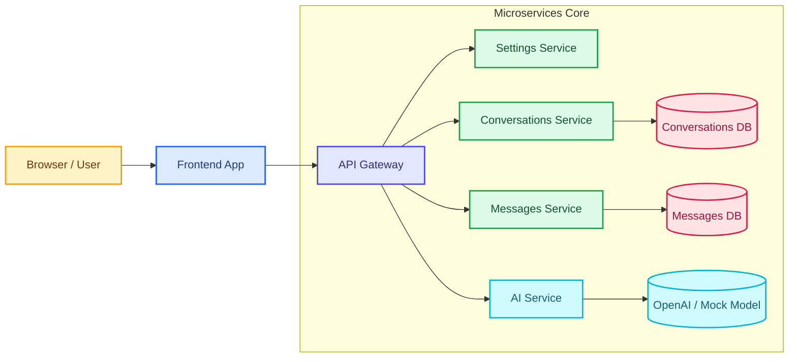
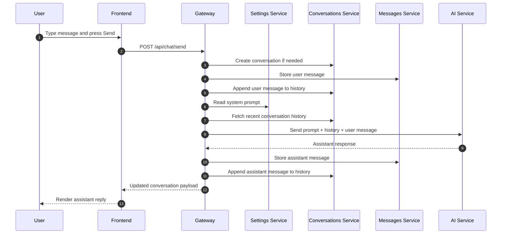

# Microservices Chat App

This repository is the microservices version of the chat demo. It splits the app into focused services so you can show how a real system grows beyond a monolith while keeping each service small, understandable, and independently replaceable.

## What This App Demonstrates

- A frontend served separately from the backend API.
- A gateway that centralizes routing and request orchestration.
- Independent services for settings, conversations, messages, and AI generation.
- Local persistence with Docker volumes.
- A smoke test that exercises the end-to-end flow.

## System Overview

The architecture is intentionally feature-oriented:

- Frontend (`frontend/`) provides the browser UI.
- Gateway (`gateway/`) is the single API entry point for the UI.
- Settings service (`settings-service/`) stores the global system prompt.
- Conversations service (`conversations-service/`) manages conversation metadata and conversation-level message history.
- Messages service (`messages-service/`) stores the message ledger.
- AI service (`ai-service/`) wraps the language model call and supports mock mode for local demos.

## Architecture Diagram

This diagram shows the service boundaries and the gateway-centered request path. The color coding helps viewers quickly separate presentation, orchestration, and persistence responsibilities.



Why this diagram matters:

- It shows the gateway as the single entry point instead of exposing every service directly.
- It makes service ownership visible: settings, conversations, messages, and AI are separated on purpose.
- It supports the discussion about scaling, resilience, and independent deployment.

### Port Map

- Frontend: `http://localhost:3000`
- Gateway: `http://localhost:8080`
- Settings service: `http://localhost:8001`
- Conversations service: `http://localhost:8002`
- Messages service: `http://localhost:8003`
- AI service: `http://localhost:8004`

## Request Flow

When the user sends a message from the UI, the system works like this:



1. The frontend sends the request to the gateway.
2. The gateway creates a conversation if needed.
3. The gateway stores the user message in the messages service.
4. The gateway appends the message to the conversation history.
5. The gateway reads the global system prompt from the settings service.
6. The gateway fetches the recent conversation history.
7. The gateway sends the combined context to the AI service.
8. The AI service returns a generated assistant response.
9. The gateway stores the assistant message in both message stores.
10. The updated conversation is returned to the frontend.

That flow is the heart of the demo. It shows why microservices need clear contracts, strong orchestration, and careful data ownership.

Flow split:

- Presentation and orchestration: `User -> Frontend -> Gateway`
- Service ownership and persistence: `Settings`, `Conversations`, `Messages`, and `AI`

## Repository Layout

- `frontend/` — static chat UI served with `http-server`
- `gateway/` — API orchestration, CORS, request proxying, and response composition
- `settings-service/` — system prompt storage
- `conversations-service/` — conversation list, creation, and per-conversation history
- `messages-service/` — message persistence and retrieval
- `ai-service/` — OpenAI integration and mock mode
- `scripts/smoke_test.sh` — quick end-to-end verification script
- `docker-compose.yml` — local composition for all services

## Prerequisites

- Docker Desktop or Docker Engine with Compose
- Node.js 18+ and `npm` for the frontend if you want to run it outside Docker
- A valid `OPENAI_API_KEY` for real AI responses, or `OPENAI_MOCK=true` for offline demo mode

## Quick Start With Docker Compose

This is the recommended way to run the full system.

1. Open a terminal in `microservices/`.
2. Make sure `.env` contains the AI configuration you want.
3. Start all services:

```bash
docker-compose up --build
```

4. Open the app in your browser:

```text
http://localhost:3000
```

5. Use the UI to send a message and save the system prompt.

6. Stop the system when you're done:

```bash
docker-compose down
```

If you want to remove persisted local volumes as well, use:

```bash
docker-compose down -v
```

## Frontend Setup and Run

The frontend is a minimal static app. It is intentionally simple so the focus stays on service boundaries and orchestration.

### What the frontend does

- Renders the chat interface.
- Lists conversations.
- Lets the user edit the system prompt.
- Sends chat requests to the gateway.
- Displays the conversation history returned by the backend.

### Run the frontend with Docker

When you use `docker-compose up --build`, the frontend starts automatically on port `3000`.

### Run the frontend locally without Docker

1. Change into the frontend folder:

```bash
cd frontend
```

2. Install dependencies:

```bash
npm install
```

3. Start the static server:

```bash
npm start
```

This runs `http-server` and serves `frontend/public/` on `http://localhost:3000`.

### Why the frontend is separate

- It keeps the UI deployment independent from backend services.
- It mirrors a common production pattern where frontend assets are served separately or from a CDN.
- It makes CORS and gateway behavior visible in the demo.

## Backend Setup and Run

In this app, the backend is not one service. It is a set of focused services, each with a small responsibility.

### Gateway

The gateway is the public API entry point. It:

- Accepts chat and settings requests from the frontend.
- Proxies requests to the specialized services.
- Handles retry logic for transient upstream failures.
- Assembles the final chat workflow.
- Enables CORS for `http://localhost:3000` so the frontend can talk to it during development.

Run it locally from `microservices/gateway/`:

```bash
uvicorn main:app --reload --port 8080
```

### Settings service

This service stores the global system prompt.

Run it locally from `microservices/settings-service/`:

```bash
uvicorn main:app --reload --port 8001
```

### Conversations service

This service owns conversation metadata and the serialized list of messages attached to each conversation. It uses a local SQLite database mounted through a Docker volume.

Run it locally from `microservices/conversations-service/`:

```bash
uvicorn main:app --reload --port 8002
```

### Messages service

This service keeps the message ledger in its own SQLite database. Separating it from conversations is useful for demonstrating service ownership and different storage boundaries.

Run it locally from `microservices/messages-service/`:

```bash
uvicorn main:app --reload --port 8003
```

### AI service

This service wraps the model call. It can run in two modes:

- Real mode: uses `OPENAI_API_KEY` and `OPENAI_MODEL`.
- Mock mode: set `OPENAI_MOCK=true` to return deterministic responses for local demos.

Run it locally from `microservices/ai-service/`:

```bash
uvicorn main:app --reload --port 8004
```

## Environment Variables

The `.env` file controls the AI service and any related configuration.

Common values used by this scaffold:

- `OPENAI_API_KEY` — required when `OPENAI_MOCK=false`
- `OPENAI_MODEL` — defaults to `gpt-4.1-mini`
- `OPENAI_MOCK` — set to `true` for offline demo mode
- `SYSTEM_PROMPT` — default assistant instruction used by the AI service

Best practice:

- Never commit real secrets.
- Use mock mode for demos and CI when you do not need external API calls.
- Keep service-specific configuration close to the service that uses it.

## API Endpoints

### Gateway endpoints

- `GET /health` — gateway health check
- `POST /api/chat/send` — send a message, persist it, call the AI service, and return the updated conversation
- `POST /api/messages` — proxy message creation
- `POST /api/conversations` — create a conversation through the gateway
- `GET /api/conversations` — list conversations
- `GET /api/conversations/{conversation_id}` — fetch one conversation
- `GET /api/settings` — read the system prompt
- `POST /api/settings` — update the system prompt
- `POST /api/generate` — proxy generation directly to the AI service

### Service endpoints

- `GET /health` — available on every service
- `GET /settings` and `POST /settings` — settings service only
- `GET /conversations`, `POST /conversations`, `GET /conversations/{id}`, `POST /conversations/{id}/messages` — conversations service only
- `GET /messages`, `POST /messages` — messages service only
- `POST /generate` — AI service only

## Smoke Test

The smoke test gives you a quick end-to-end verification after startup.

```bash
./scripts/smoke_test.sh
```

What it checks:

- Creating a conversation through the gateway
- Generating a response through the gateway
- Listing conversations through the gateway

Tip: the script uses a short wait before hitting the API, so if your environment starts slowly you may want to rerun it once the stack is fully healthy.

## Best Practices for Microservices

These are the principles worth explaining in the video.

### 1. Keep service boundaries clear

Each service should own one business capability. Avoid making every service depend on every other service, because that recreates the monolith in a distributed form.

### 2. Separate data ownership

Each service should own its own database or storage boundary. In this scaffold:

- Conversations service owns conversation state.
- Messages service owns message records.
- Settings service owns the system prompt.

That separation reduces coupling and helps teams evolve independently.

### 3. Use the gateway pattern intentionally

The gateway is useful when you want one stable entry point for the frontend, but keep it thin. It should orchestrate, validate, and route, not become a second monolith.

### 4. Prefer explicit contracts

APIs should be predictable and versionable. Return well-structured JSON, document request/response shapes, and avoid hidden behavior.

### 5. Build for observability

- Log requests and failures clearly.
- Add health checks.
- Watch for timeouts, retries, and upstream failures.
- Make it easy to tell which service failed.

### 6. Design for failure

Network calls fail. Services may be slow or unavailable. The gateway already includes retry logic for transient issues, which is a good teaching moment for resilience.

### 7. Keep local development simple

Docker Compose is the right level of tooling here because it lets one person reproduce the whole stack without needing Kubernetes.

### 8. Mock external dependencies in demos and tests

The AI service supports mock mode. That makes recording, testing, and CI much more reliable.

### 9. Automate smoke checks

Have one short command that proves the system works after startup. This is especially useful in a distributed system where one broken service can break the whole experience.

## Advantages of Microservices

- Teams can work on services independently.
- Services can scale based on their own load profile.
- Fault isolation is better when boundaries are respected.
- Different technologies can be used where they make sense.
- Deployments can be more targeted.

## Disadvantages of Microservices

- More operational complexity than a monolith.
- Debugging requires tracing across services.
- Network latency and service failure become part of the application design.
- Data consistency is harder because data is distributed.
- Local development can be heavier without Docker Compose or good tooling.

## When to Choose Microservices

Choose microservices when:

- You have multiple teams that need independent release cycles.
- Different parts of the product scale very differently.
- You need stronger isolation between domains.
- You have the operational maturity to support distributed systems.

Prefer a monolith when:

- The team is small.
- The product is still changing quickly.
- You want simpler debugging and deployment.
- The overhead of distribution is greater than the benefit.

## YouTube Walkthrough Script

Use this as the narration structure for the video.

1. Introduce the problem — why the monolith was split into services.
2. Show the folder structure and explain each service by responsibility.
3. Open `docker-compose.yml` and explain the ports and containers.
4. Start the stack with `docker-compose up --build`.
5. Open the frontend at `http://localhost:3000`.
6. Save a new system prompt and explain how the settings service stores it.
7. Send a chat message and explain the request flow through the gateway.
8. Show how the conversations and messages services store state.
9. Show how the AI service generates the assistant response.
10. Run the smoke test to prove the full flow works.
11. Explain the advantages and disadvantages of the architecture.
12. Wrap up with best practices and when microservices are actually worth the cost.

## Suggested Demo Commands

```bash
cd microservices
docker-compose up --build
```

```bash
cd microservices/frontend
npm install
npm start
```

```bash
cd microservices/gateway
uvicorn main:app --reload --port 8080
```

```bash
./scripts/smoke_test.sh
```

## Troubleshooting

- If the frontend cannot talk to the gateway, confirm the gateway is running on port `8080` and CORS is allowing `http://localhost:3000`.
- If the AI service fails, check `OPENAI_API_KEY` and whether `OPENAI_MOCK` is set correctly.
- If Docker volumes keep old data, use `docker-compose down -v` and start again.
- If a service port is already in use, stop the conflicting process or change the port mapping in `docker-compose.yml`.


## License

This scaffold is intended for learning, demos, and architecture walkthroughs.
