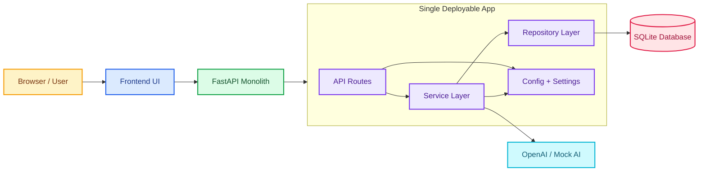

# Monolithic App (Video 1)

This repository demonstrates a beginner-friendly monolithic FastAPI application that hosts both the backend API and the static frontend. It's designed for teaching core concepts, rapid iteration, and demonstrating how a conversation assistant can be built, persisted, and served from a single process.

**Highlights:**
- Simple local development with `uvicorn`.
- Switchable OpenAI mock mode for offline demos.
- SQLite persistence for ease of use.
- Minimal frontend served by the backend for zero-deploy demos.

## Goals for the Video

- Show how to run the app locally (development mode).
- Explain environment configuration and secrets handling.
- Walk through the code layout and key files.
- Discuss best practices, trade-offs, and when to split into microservices.
- Provide a clear, reproducible demo script with talking points.

## Repo Structure (high level)

- backend/ — FastAPI application, database models, services, and API routes
- frontend/ — static HTML/CSS/JS served by the backend in dev mode
- plan.md — project plan and learning objectives

## Architecture Diagram

This diagram shows the monolith as one deployable application with clear internal layers. The key teaching point is that the app stays in one process, but the code is still organized by responsibility.



Why this diagram matters:

- It makes it obvious that the deployment is simple even though the code is layered.
- It shows where business logic should live so the monolith can later evolve safely.
- It helps viewers compare a clean monolith to the distributed version in Video 2.

## Quick Start — Development (Windows / macOS / Linux)

1. Open a terminal and change into the backend directory:

```powershell
cd monolithic_app/backend
```

2. Create and activate a Python virtual environment (recommended):

Windows (PowerShell):
```powershell
python -m venv .venv
.\.venv\Scripts\Activate.ps1
```

macOS / Linux:
```bash
python3 -m venv .venv
source .venv/bin/activate
```

3. Install dependencies:

```bash
pip install -r requirements.txt
```

4. Copy the example environment file and configure secrets:

```bash
copy .env.example .env        # Windows (PowerShell)
cp .env.example .env          # macOS / Linux
```

Edit `.env` and set `OPENAI_API_KEY` or enable the mock mode for an offline demo:

- To use real OpenAI: set `OPENAI_API_KEY=sk-...` (do not commit this file)
- To demo without OpenAI: set `OPENAI_MOCK=true`

5. Run the server in development mode (auto-reload):

```bash
uvicorn app.main:app --reload --port 8000
```

6. Open the demo in your browser:

http://localhost:8000

Note: The backend serves the static frontend during development so you get a single URL demo.

## Frontend — Install & Run (optional separate serving)

This project includes a minimal static frontend in `frontend/public/`. You can have the backend serve it (recommended for a single-process demo), or run the frontend separately during development.

Prerequisite: Node.js (14+ or LTS) and `npm` installed.

1. Open a terminal and change into the frontend directory:

```bash
cd monolithic_app/frontend
```

2. Install npm dependencies:

```bash
npm install
```

3. Start a local static server (dev):

```bash
npm run dev
```

This runs `http-server` and serves the `public/` folder at `http://localhost:3000` by default.

4. Open the frontend in your browser:

http://localhost:3000

Notes when serving frontend separately:

- Ensure the backend is running (see development steps) so API calls succeed.
- If the frontend is served on a different origin (port 3000) the backend must allow CORS from `http://localhost:3000`. The demo backend includes CORS configuration in development — if you see CORS errors, enable `fastapi.middleware.cors.CORSMiddleware` in `backend/app/main.py` or run the frontend through the backend.
- For recording the YouTube demo, serving the frontend from the backend (single origin) simplifies CORS and session handling.

## Quick Start — Production (recommendations)

- Use an ASGI server like `uvicorn` behind a process manager or `gunicorn` with `uvicorn.workers.UvicornWorker` for multiple worker processes.
- Use a real production database (PostgreSQL) and run schema migrations using `alembic` or `yoyo`.
- Serve static assets separately (CDN) and place the app behind a TLS-terminating proxy (e.g., Nginx).

Example `gunicorn` command for production (Unix):

```bash
gunicorn -k uvicorn.workers.UvicornWorker -w 4 -b 0.0.0.0:8000 app.main:app
```

## Environment variables and secrets

- Keep secrets out of version control; add `.env` to `.gitignore`.
- For local demo and CI, prefer a vault/secrets manager (GitHub Actions secrets, Azure Key Vault, AWS Secrets Manager).
- Example keys used by this project: `OPENAI_API_KEY`, `OPENAI_MOCK`.

## API Endpoints

- `GET /api/health` — basic healthcheck
- `GET /api/conversations` — list conversations
- `GET /api/conversations/{id}` — get conversation by id
- `POST /api/chat/send` — send a user message and receive assistant response
- `GET /api/settings/system-prompt` — read system prompt
- `PUT /api/settings/system-prompt` — update system prompt

(Use the frontend or `curl`/Postman to exercise these endpoints.)

## Local demo mode (no OpenAI calls)

Set `OPENAI_MOCK=true` in `.env` to make the assistant return canned responses. This is ideal for recording a YouTube demo without incurring API costs or needing internet access.

## File pointers (see code)

- Backend entry: `backend/app/main.py`
- API routes: `backend/app/api/routes.py` (or similar)
- Services: `backend/app/services/` (business logic)
- Frontend files: `frontend/public/` served at `/`

Refer to the backend README for more details: [backend README](backend/README.md#L1)

## Best Practices for Monolithic Apps

These are pragmatic recommendations you can narrate in your video:

- Keep a clear package/module layout: separate `api`, `core`, `models`, `repositories`, and `services`.
- Use environment-specific config and a robust config loader (12-factor: `config` from env vars).
- Avoid embedding secrets; use environment variables and a secrets manager for production.
- Add structured logging (JSON) and correlation IDs for tracing requests.
- Use database migrations from the start to avoid schema drift.
- Keep business logic in services, not in route handlers — easier to test and later extract.
- Write tests for services and integration tests for APIs; show `pytest` example in video.
- Add health and readiness probes for orchestration when you containerize.
- Design idempotent endpoints where possible and validate inputs strictly.

When to keep the monolith:

- Rapid prototyping and user testing.
- Small teams where coordination overhead of services is higher than benefits.
- Tight, synchronous features that benefit from direct function calls.

When to consider splitting into microservices:

- Clear, independently deployable domains with differing scale or SLAs.
- Frequent independent deployments by different teams.
- Need for distinct scaling, reliability, or language/runtime choices.

## Advantages and Disadvantages (talking points)

Advantages:

- Simpler local development and debugging.
- Fewer moving parts: one repo, one deployable artifact.
- Lower operational overhead early on (no service mesh, fewer infra components).

Disadvantages:

- Scaling becomes coarser-grained; you can't scale a hot path independently.
- As the codebase grows, deploys take longer and risk increases.
- Tighter coupling can slow feature velocity for large teams.

## Testing and CI (short)

- Unit tests: place in `backend/tests/`, run with `pytest`.
- Add a GitHub Actions workflow to run tests and linting on PRs.

Quick test command:

```bash
cd monolithic_app/backend
pytest -q
```

## Troubleshooting

- If `uvicorn` doesn't start, check that the virtualenv is active and `requirements.txt` installed.
- If OpenAI calls fail, verify `OPENAI_API_KEY` and network access, or use `OPENAI_MOCK=true`.

## Next steps (for learners)

- Add database migrations and demonstrate a schema change.
- Add a CI pipeline and automated tests.
- Containerize the app and deploy to a small Kubernetes cluster.
- Extract a single bounded context into a separate service as an exercise.

## Contributing

PRs welcome. Keep changes small and include tests for new behavior.

## License

This project is provided for learning and demo purposes.

